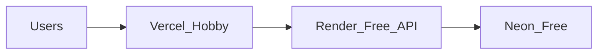

# ClinicEase — Deploy guide

## Start here: free tier ($0/month)

**Stack:** Vercel Hobby (frontend) + **Render Free** (API) + Neon Free (Postgres)

| Piece | Service | Notes |
|-------|---------|--------|
| SPA | Vercel Hobby | Free |
| API + sockets + cron | Render free Web Service | Sleeps after ~15 min idle (cold start 30–60s) |
| DB | Neon free | Pooled `DATABASE_URL` |
| Pay | Mock pay or Razorpay **test** keys | No fees until live |
| OTP / WhatsApp | Mock (`OTP_DEV_CODE`, logs) | No Twilio bill |
| Captcha | Stub or free reCAPTCHA | |

Set **`FREE_TIER=true`** on the API so production can boot without paid Twilio/live Razorpay.



### 1. GitHub

Push this repo to GitHub (do not commit `.env`).

### 2. Neon

1. Create a free project at [neon.tech](https://neon.tech).
2. Copy the **pooled** connection string (`?sslmode=require`).

### 3. Render (API)

**Option A — Blueprint**

1. Render Dashboard → New → Blueprint → select repo.
2. Uses [`backend/render.yaml`](backend/render.yaml).
3. Paste `DATABASE_URL` and set `CLIENT_ORIGIN` (Vercel URL; can update after step 4).

**Option B — Manual**

1. New → Web Service → this repo.
2. **Root Directory:** `backend`
3. **Runtime:** Docker (`Dockerfile`)
4. Plan: **Free**
5. Health check path: `/api/health`
6. Environment:

```
NODE_ENV=production
FREE_TIER=true
DATABASE_URL=<neon pooled url>
JWT_SECRET=<at least 32 random characters>
CLIENT_ORIGIN=https://YOUR-APP.vercel.app
WHATSAPP_MODE=mock
ALLOW_MOCK_PAY=true
OTP_DEV_CODE=123456
RECAPTCHA_MODE=stub
SEED_DEMO_USERS=true
LOG_LEVEL=info
```

7. Deploy. Open `https://<service>.onrender.com/api/health` → `{ "ok": true, "db": "up" }`.
8. **Seed** (Render Shell on the service):

```bash
npm run db:seed
```

Demo logins (when `SEED_DEMO_USERS=true`): `patient@` / `doctor@` / `admin@clinicease.app` · password `demo1234` · OTP `123456`.

> Cold start: after idle sleep, the first request can take up to a minute. Refresh once.

### 4. Vercel (frontend)

1. Import repo → **Root Directory:** `frontend`
2. Build: `npm run build` · Output: `dist`
3. Environment variables:

```
VITE_API_URL=https://<service>.onrender.com
VITE_SOCKET_URL=https://<service>.onrender.com
VITE_USE_MOCK_CLINIC=false
VITE_DEMO_LOGIN=true
VITE_RECAPTCHA_SITE_KEY=
VITE_RAZORPAY_KEY_ID=
VITE_SENTRY_DSN=
```

4. Deploy. Then set Render `CLIENT_ORIGIN` to the Vercel URL and redeploy API if needed.

See also [`frontend/.env.example`](frontend/.env.example).

---

## Paid production (later)

When you are ready for real patients: set **`FREE_TIER=false`** (or remove it), use live Razorpay + Twilio + reCAPTCHA, and prefer always-on hosting (Render paid or Railway). See env contract in [`backend/.env.example`](backend/.env.example) (strict production section).

### Strict production checklist

- `FREE_TIER` unset/false
- `WHATSAPP_MODE=live` + Twilio SMS/WhatsApp
- `RECAPTCHA_MODE=live` + secrets
- Razorpay live keys + webhook → `/api/payments/webhook`
- `ALLOW_MOCK_PAY=false`, empty `OTP_DEV_CODE`
- `VITE_DEMO_LOGIN=false`

---

## Secret rotation

1. JWT → users re-login  
2. Razorpay webhook secret (dashboard + host env together)  
3. Twilio tokens  

## Uptime (optional, free)

Point a free uptime ping (e.g. UptimeRobot) at `/api/health` every 5 minutes to reduce Render sleep (still not guaranteed awake forever on free).
